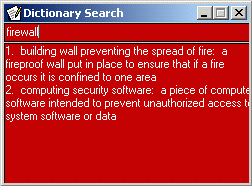



## Dictionary Parse

### Description

How to obtain the dictionary spelling using inet control and a parsing table.(If you call it that) This is the complete coding.(Maybe I should be more clear) The alternates source looking is for one source not found it searches for the next inline. If that one isn't found it goes on to the next one. I did this to get the Definition of the word meaning. What fun is it to get a return no matches found? this was not here for feedback nore was I looking for feedback.
 
### More Info
 

             |
---                |---
**Submitted On**   |2004-12-13 20:05:18
**By**             |[Quake](https://github.com/Planet-Source-Code/PSCIndex/blob/master/ByAuthor/quake.md)
**Level**          |Beginner
**User Rating**    |5.0 (15 globes from 3 users)
**Compatibility**  |VB 6\.0
**Category**       |[Miscellaneous](https://github.com/Planet-Source-Code/PSCIndex/blob/master/ByCategory/miscellaneous__1-1.md)
**World**          |[Visual Basic](https://github.com/Planet-Source-Code/PSCIndex/blob/master/ByWorld/visual-basic.md)
**Archive File**   |[Dictionary18308512182004\.zip](https://github.com/Planet-Source-Code/quake-dictionary-parse__1-57734/archive/master.zip)

